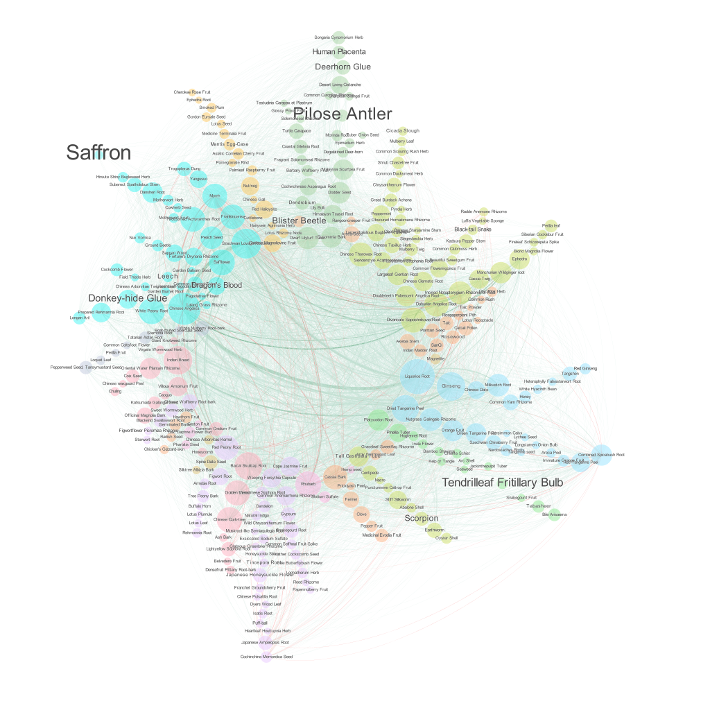

# ABSTRACT

Traditional Chinese Medicines (TCM) have been heavily promoted in the Covid-19 pandemic. They achieve treatment effects by prescribing different combinations of medical herbal ingredients. Here we illustrate how these combinations form a network for the visual analysis and provide insights for those who are in the TCM value chain.  

# Introduction

During the Covid-19 pandemic, remedies known as traditional Chinese medicine, or commonly TCM, are heavily promoted by the state government of China. Some TCM treatments, notably Lianhua Qingwen, became frequently recommended Chinese patent medicine for the alleviation of mild symptoms of Covid-19. Moreover, in recent years, TCM has been expanding at a notable rate as advocating natural ingredients becomes a worldwide trend. According to Global Trade Magazine, in 2016, the sector totaled $139bn, then expanded a further 20% throughout 2017, and the pattern of growth can be seen not only domestically but also overseas. According to Nature, the selling of TCM and other related products to One Belt One Road countries has surged, experiencing a whopping 54% growth to $295mm. The project group sees tremendous business opportunities behind this swelling demand and combines data and analysis to unearth actionable insights that help relevant businesses improve their performance.

Grounded in the idea of harmony between humans and nature, TCM could in principle refer to a broad range of Chinese medical practices including herbal medicine, acupuncture, massage, exercise (qigong), etc. This project focuses on studying Chinese herbal medicines, and more specifically, the interconnection between them and how to make the best use of this information. Unlike Western medicine, which often relies on the same set of chemical formulas to address health issues for patients with similar symptoms, Chinese medicine provides a more personalized and targeted approach. Chinese medicine combines, adds or removes certain ingredients based on a patient’s symptoms as well as response to the treatment. Doctors can prescribe different formulas for the same disease upon the patient’s conditions. More specifically, Chinese medicine is commonly categorized by herbal functionality and some ingredients are used in conjunction with those in other categories to reach the maximum benefits. The interconnection between different ingredients and their functional groups would thus make an impact on their prices, demand, and availability. In this project, we will put it into perspective, depict relations among different ingredients and functionality groups, indicate alternative uses or combinations of ingredients, and analyze how TCM-related businesses can make use of this information which may have been overlooked before. 

# Data 
To understand how various herbal ingredients relate to different prescriptions, we collected information about both ingredients and prescriptions.

## Ingredients 
The database (https://herbaltcm.sn.polyu.edu.hk/herbal/) contains information of more than four hundred types of commonly used Chinese medicinal herbs (ingredients). Available attributes include the source, medicinal group, flavor, and meridian affinity.
## Ingredients price 
This is an official website (https://www.zyctd.com/) run by the Chinese Medicine Association. It updates information about TCM ingredients promptly from the four largest TCM ingredients markets in China, Anguo, Bozhou, Yulin, and Lotus Lake. It contains pricing information for TCM ingredients, including the price, price trends, Week Over Week (WoW), Month Over Month (MoM), and Year Over Year (YoY) comparisons. The format of the website is well-formed, so we directly built a list of ingredients, took them as keywords in the URL, and got the detailed price information. 
## TCM prescription 
The website (http://zhongyaofangji.com/) gathers some most common fang ji (TCM prescriptions) and ingredients used in each fang ji. These fang ji are mainly from traditional medical books, for example, Treatise on Febrile and Miscellaneous Diseases. We scraped them according to the solution to different diseases. To authenticate these prescriptions, we also refer to the textbook of fang ji published by the Chinese Press of Traditional Chinese Medicine. To facilitate the construction of the network edges in Gephi, we mutated the data into small pieces with only one ingredient and one prescription in each row. 
## Baidu Index 
Baidu Index (http://index.baidu.com), similar to Google Trends, provides insights over the popularity of top search queries in the Baidu search engine. We scraped the search engine index each day for the past year and calculated the change in the index for the past month and year. This change was used in regression and correlation analysis. For some rare keywords or those with low search volumes, the Baidu Index did not provide any results. We filled in zero for the rare words. 

The raw data from web scraping covered 408 herbal ingredients and 943 TCM prescriptions. This relatively small number of ingredients compared to the number of prescriptions indicates that TCM is exploiting different combinations of ingredients to achieve treatment effects.

# Network Analysis
We start with a network-based approach to explore the underlying pattern of ingredients combinations in TCM prescriptions. The nodes represent ingredients, linked if they co-exist in at least one prescription. The weight of each link represents the frequency of co-existence, turning the ingredient network into a weighted network. While ideally the ingredient concentration in each prescription should be taken into account, the lack of systematic data prevents us from analyzing at this level of detail. We take advantage of the Baidu Index to visualize the trending - red edges indicate a decrease in trending and green indicates otherwise. We detected network communities and visualized the communities using the Radial Axis layout, as implemented in Gephi (Figure 2).

Some characteristics are observed from the network:
1.	Licorice Root, Chinese Angelica, and Szechwan Lovage Rhizome are the top three connected ingredients in terms of both degrees and weighted degrees. 
2.	Some of the most expensive ingredients are of moderate degree centrality in the network, except that Saffron appears to have few connections. The most connected ingredients tend to be the ones with relatively low prices.
3.	The network illustrates that connections widely exist across medicinal groups. Ingredients communities tend to be formed across medicinal groups instead of within. This confirms that TCM prescriptions take advantage of various combinations of herbal ingredients to achieve treatment effects. 

We used Python’s NetworkX package to compute other network statistics. The distribution of weights (frequency of co-existence) and degrees (number of connections to each node) are both skewed. A vast majority of the edges are of weights less than 20 (Figure 3 Left); the few outlier pairs are Chinese Angelica and Szechwan Lovage Rhizome, 95; Liquorice Root and Chinese Angelica, 88; Liquorice Root and Ginseng, 73; Frankincense and Myrrh, 68; White Peony Root and Chinese Angelica, 61. Additionally, despite a few low-degree outliers, the networks approximate a power laws degree distribution. There are many ingredients with small degrees and a few ingredients with very large degrees (Figure 4).

# Result 
Throughout the study, we found the most expensive ingredient, denoted as Pilose Antler and Saffron, and the correlations between the ingredients among different price ranges. Taking the most expensive ingredient blister beetle as an example, it is an excellent herbal aphrodisiac for strengthening the liver and kidney. It is a 3000-year-old medicine and also well known for its rareness and high price. According to the TCM network, the most expensive ingredients have a moderate range of combinations, whereas many cheap ingredients have few connections. A possible explanation is that people believe in the effectiveness of ingredients, even though the treatments are expensive. For medicine manufacturers, it is crucial to ensure the stability of the inventory level of expensive ingredients so as to meet the steady demand. It would be preferential if the ingredients could be purchased at a relatively low price. 

Our study listed out the most popular ingredients and categorized them based on the medicinal group. For new medicine manufacturers, it is beneficial to start with the most common ingredients and manufacture prescriptions accordingly. For existing medicine manufacturers planning on new prescription developments, it is recommended to start with the prescriptions which have the most ingredients overlapping with its existing product line. This would save the overall production cost by using existing product lines. On the other hand, it would also reduce the warehouse costs by saving spaces by optimizing the total number of ingredients required. 

We found that some ingredients decreased in search index volume over the past month, such as frankincense, red peony root, and Dahurian angelica root. This is likely associated with the heaving promotion by the Ministry of Health of China during Covid-19, and people tend to search for popular medicines. The increase and decrease in search index reflect the market appetite, however, the changes in the search index were not directly correlated with the price changes. The medicine manufacturers could take the changes in search index as a reference and adjust the purchase quantity in future months accordingly. 
Our study aimed to improve the product offering and save the overall production costs. Taking one of the largest listed companies, China Traditional Chinese Medicine Holdings Co. Limited as an example. The revenue from the local TCM integrated operation RMB 27,160,000 in 2019, representing 0.4% of total revenue (Wu, 2019). The TCM integrated operation which combines product lines and conducts local primary processing and trading of medicinal herbs and decoction. The optimization procedure leads to tremendous saving to medicine companies, and ensures the deductions are attributed to right use of manufacturing procedures.

# Conclusions and Future Work
In this project, we visualized traditional Chinese medicine prescriptions in a network of ingredients. Our network-based study has identified the correlation between traditional Chinese medicine based on its popularity, price, and medicinal group. The study could provide medicine manufacturers with better business planning and improve the medicine manufacture procedure. 

Our work reveals the limitations of the prescription data sets currently available. Firstly, the sample size is relatively small, we only considered the most common herbal ingredients and TCM prescriptions. There are some other rare ingredients and a larger population will be required in a future study. Secondly, prescription effectiveness may vary among individual patients, the prescription may not represent the treatment for the whole population. The difference among individuals and outliers could be considered in future studies. Thirdly, the lack of systematic data prevents us from accessing the concentration of each ingredient in prescriptions. we could improve the network analysis by collecting the concentration details in future studies. Lastly, the change in price and search index may violate at different times under uncertainties (such as Covid-19 or new regulations), the association of these factors should be investigated in future studies.

# Reference
1.	Wu, X. (2019). China Traditional Chinese Medicine Holdings Co. Limited - Interim Results. Retrieved from http://iis.aastocks.com/20190819/003590026-0.PDF
2.	Ahn, Yong-Yeol & Ahnert, Sebastian & Bagrow, James & Barabasi, Albert-Laszlo. (2011). Flavor network and the principles of food pairing. Scientific Reports. 1. 10.1038/srep00196. 
3.	Smiley, S. (2020, February 13). From A to QI: The Global Rise of Traditional Chinese Medicine. Retrieved from https://www.globaltrademag.com/from-a-to-qi-the-global-rise-of-traditional-chinese-medicine/
4.	Hinsley, A., Milner-Gulland, E.J., Cooney, R. et al. Building sustainability into the Belt and Road Initiative’s Traditional Chinese Medicine trade. Retrieved from https://doi.org/10.1038/s41893-019-0460-6

For more details see [GitHub Flavored Markdown](https://guides.github.com/features/mastering-markdown/).
